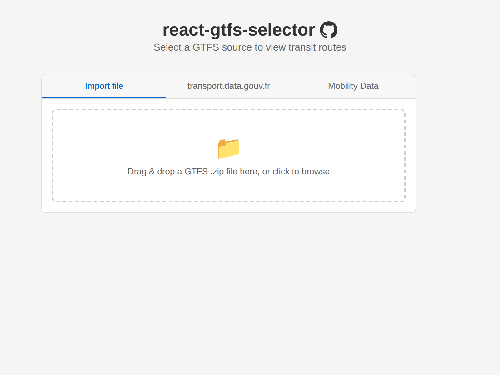
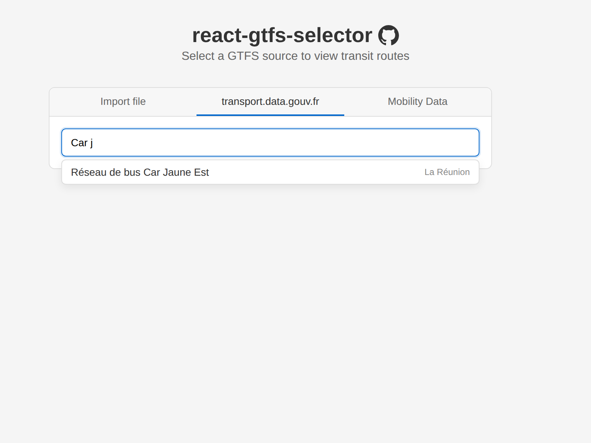

# react-gtfs-selector

[](https://www.npmjs.com/package/react-gtfs-selector)

A React component that lets users select a GTFS data source, either by dragging and dropping a local `.zip` file or by searching online GTFS feeds.

**[Live demo](https://sysdevrun.github.io/react-gtfs-selector/)**

| Import file | Online search |
|:-----------:|:-------------:|
|  |  |

## Install

```bash
npm install react-gtfs-selector
```

## Usage

```tsx
import { GtfsSelector } from 'react-gtfs-selector';
import 'react-gtfs-selector/style.css'; // optional — bundled default styles

function App() {
  return (
    <GtfsSelector
      onSelect={(result) => {
        if (result.type === 'file') {
          console.log('Got file:', result.fileName, result.blob);
        } else {
          console.log('Got URL:', result.title, result.url);
        }
      }}
    />
  );
}
```

The component shows a **tabbed interface**:

1. **Import file** — drag & drop or click to browse for a GTFS `.zip` file
2. **transport.data.gouv.fr** — search French public transit GTFS feeds
3. **Mobility Database** — search worldwide GTFS feeds from the [Mobility Database](https://mobilitydatabase.org), available in two modes:
   - **CSV catalog** (`mobilityDataCsv`) — no authentication required, loads the full catalog CSV and filters locally
   - **API** (`createMobilityDataSource({ apiToken })`) — requires a Bearer token, searches server-side via the Mobility Database API

## Props

| Prop | Type | Default | Description |
|------|------|---------|-------------|
| `onSelect` | `(result: GtfsSelectionResult) => void` | *required* | Callback when a source is selected |
| `sources` | `GtfsSource[]` | built-in sources | Custom source list (pass `[]` to disable online search) |
| `styled` | `boolean` | `true` | Set to `false` to disable default CSS class names |
| `className` | `string` | — | Additional CSS class on the root element |

## Callback result

```ts
type GtfsSelectionResult =
  | { type: 'file'; blob: Blob; fileName: string }
  | { type: 'url'; url: string; title: string; gtfsRtUrls?: string[] };
```

## transport.data.gouv.fr source

French public transit GTFS feeds, enabled by default. Datasets are cached in localStorage for 24h.

```tsx
import { GtfsSelector, transportDataGouvFr } from 'react-gtfs-selector';

<GtfsSelector onSelect={handleSelect} sources={[transportDataGouvFr]} />
```

## Mobility Database sources

The CSV source works out of the box with no configuration:

```tsx
import { GtfsSelector, mobilityDataCsv } from 'react-gtfs-selector';

<GtfsSelector onSelect={handleSelect} sources={[mobilityDataCsv]} />
```

To use the API source, pass a configured instance with your token:

```tsx
import { GtfsSelector, createMobilityDataSource } from 'react-gtfs-selector';

const mobilityApi = createMobilityDataSource({ apiToken: 'your-token' });

<GtfsSelector onSelect={handleSelect} sources={[mobilityApi]} />
```

Both sources are included by default (CSV is enabled, API is disabled until a token is provided).

## Custom sources

You can implement the `GtfsSource` interface to add your own GTFS feed providers:

```ts
import type { GtfsSource } from 'react-gtfs-selector';

const mySource: GtfsSource = {
  id: 'my-source',
  label: 'My GTFS Provider',
  available: true,
  async fetchDatasets() { /* ... */ },
  search(datasets, query) { /* ... */ },
};

<GtfsSelector onSelect={handleSelect} sources={[mySource]} />
```

## Loading GTFS data

Once the user selects a source, use [`gtfs-sqljs`](https://www.npmjs.com/package/gtfs-sqljs) to load and query the GTFS data:

```tsx
import { GtfsSelector } from 'react-gtfs-selector';
import { GtfsSqlJs } from 'gtfs-sqljs';
import type { GtfsSelectionResult } from 'react-gtfs-selector';

function App() {
  const handleSelect = async (result: GtfsSelectionResult) => {
    let gtfs: GtfsSqlJs;

    if (result.type === 'url') {
      gtfs = await GtfsSqlJs.fromZip(result.url);
    } else {
      const data = await result.blob.arrayBuffer();
      gtfs = await GtfsSqlJs.fromZipData(data);
    }

    const routes = gtfs.getRoutes();
    console.log('Routes:', routes);

    gtfs.close();
  };

  return <GtfsSelector onSelect={handleSelect} />;
}
```

## Styling

Import `react-gtfs-selector/style.css` for default styles. All CSS classes are prefixed with `rgs-`. Pass `styled={false}` to opt out entirely and provide your own styles.

## Development

```bash
npm install
npm test        # run tests
npm run build   # build the library
```

## License

MIT — Théophile Helleboid <contact@sys-dev-run.fr>
